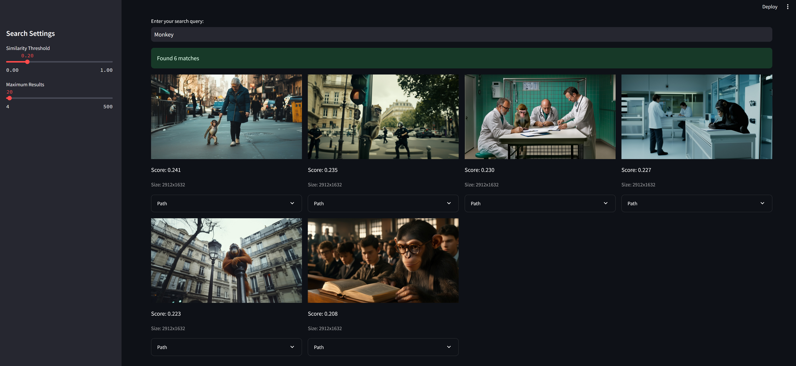

# AI Fast Image Search

This AI based tool is made for managing and searching large image collections seamlessly with machine learning-based text query capabilities.

Fast Image Searcher offers an advanced solution for efficiently organizing, querying, and retrieving images from large-scale collections. Leveraging AI/machine learning, this tool enables precise and swift text-based image searches.

## Features

- **Efficient Image Database Creation**: Generate a compact representation (embedding) of each image in your collection using the CLIP model. This transforms the images into a space where similar items are close together, facilitating rapid searches.
  
- **Search with Text Queries**: Input a search query or question, and the tool will return the most relevant images from your database. This is powered by the CLIP model's ability to understand and compare text and image semantics.

- **Rapid Lookup**: The tool uses vector similarity search for finding the images, ensuring quick responses even with a large database.

- **Threshold-Based Filtering**: Customize the sensitivity of your search results with a similarity threshold.

- **Results Customization**: Limit the maximum number of results displayed, and view images in an easy-to-navigate grid format.



## Installation

The tool requires Python to run. Clone the repository and install the dependencies:

```bash
git clone https://github.com/reab5555/AI-Fast-Image-Search.git
cd AI-Fast-Image-Search
pip install -r requirements.txt
```

## Usage

### Create a Database
- Use `build_db.py` to create the image embeddings database by pointing to your image directory. This will generate `image_embeddings.pkl`, containing all the processed image data.

### Search Images
- Load `image_embeddings.pkl` using `Image_searcher.py`. Enter your search query in the application’s interface and tweak the similarity threshold and result limits as required.

### View Results
- Review the search results that display images best matching your query, accompanied by their similarity scores.

## Getting Started

To run the application locally, launch it with the following command:

```bash
streamlit run Image_searcher.py
```

Open your browser and navigate to the provided local URL to access the user interface. Remember, `build_db.py` is used for creating the database, while `Image_searcher.py` is used for loading and searching it.
